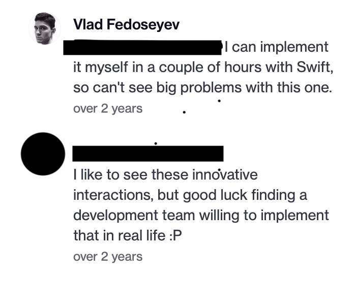
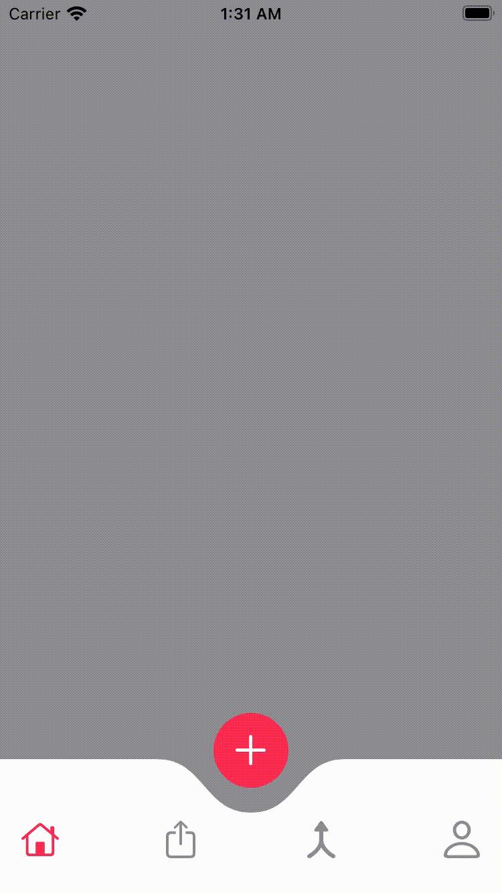

#  Tabbar Animation Exploration

I am going to breakdown each indivudal step for creating a custom tabbar with a foldout subitem menu on clicking a button.

This effect is inspired by the follow dribble.

[Tabbar Exploration](https://dribbble.com/shots/5315582-Tabbar-Exploration) by Vlad Fedoseyev

Not only is this effect beautiful, this is also wonderful UX. Its bold "Plus" button directs the user to the next step in your apps Journey.

What stood out personally  for me about this effect was the discussion by the author in the feedback thread.

### 📝 **_TLDR:_**
> user1: good luck getting a development team to do it
> author: I can do it in couple of hours no biggy

I thought to myself;

> "Can you? other than the curved tabbar, I won't have a clue where to start..."

Not to be deterred by something as trivial as "I don't know how" I sought to figure out how to achieve the exact same tabbar in a swiftUI app. The original dribble shows a media focus app, I wanted to explore WWDC21 on device AI Training so I've created an app based on the concept around building AI Modules on device that could later be exported to xcode.

## Tabbar Exploration Breakdown
If we stare at the animation long enough we can easily breakdown the individual components and animations. 

1) The default tabbar has been replaced by a custom view, even in UIKit, the path rendering would have been a custom layer to achieve the 'dip' in the tabbar.
2) There is a second submenu that appears on click of the 'plus' button
3) There placement is equally displaced, the inner most icons have matching center Y points, and the outer icons Y center matches.
4) The main tabbar disappears when the second tabbar is to appear
5) The buttons of the second menu scale to full size during their interpolation to their positions.
6) Icons of the second buttons are not visible until the end of the animation, this gives the appearance of fluidity as the second tabbar 'bursts' into view
7) The plus button rotates clockwise
8) the plus button moves passed its original start position during its return and the moves to its start position
9) the plus button rotates the same amount for each animation(?)
10) The curve path is in the tabbar's center.
11) The curve path has its center point animated(?)
12) The curve path slightly goes pass its end point slightly before the animation ends

Now that we have the quintessential steps needed to recreate this afformentioned tabbar, lets first create the core componets and views that represent our app.
 
## Tabbar Walkthrough

### Creating a custom tabbar

We will write a custom Tab bar using two sources of truth,
//
// 

### Steps creating the Tabbar 
> 1. First define a Home view, this is view containing a default TabView
> 2. Define your TabItems
> 3. Now hide them!
> 4. TODO rest of the steps....

> 1. [Kavsoft Curved Tabbar](https://kavsoft.dev/SwiftUI_2.0/Native_Curved_Tabbar)

I then use the default TabView and add my custom type buttons and hide the Tabview in the `init()` of *HomeView*.
Hiding the TabView allows us to now customize the tabbar. But why does this work? 

> ####Here be dragons
>I found out that it is because SwiftUI Tabview only renders `Text` and `Image` types. 
Assigning any other type to the TabView doesn't render that types' view.
>However, you will retain the programmatic access to the view assigned to the Tabview's `Binding <SelectedValue>`.
Thus a Tabview with anything other that `Text` or `Image` will create a functioning Tabview but with blank controls.
>This could change at any time and so it is very risky to use in a production app.

## Animation Walkthrough
Most of the animation are very typical, show, hide, and offsets animations. 
The main animation feature, the bouncing curve path, what do I do there?
###New Button
When creating the animation for the new button, I had two states of the button to animate, the first being the offsetY,
and the rotation of the image.

Where I was able to animate the rotation quite easily as a views' rotation angle is animatable by default.
SwiftUI will animate from one angle to the next for you. The problem surfaces when I wanted to animate the offset.
This offset follows an ABCA animation cycle. Don't bealarmed about ABCA, that's more or less achieved with a spring animation.
But the default spring didn't quite achieve the results I wanted. 
Instead I used a custom timing curve with applied to a easeOut animation for a snap-back in place effect.
imply changing the offset didn't work.

Well I was able to figure it out with two sources of truth,
> 1. [SwiftUI LAb](https://swiftui-lab.com/swiftui-animations-part1/)
> 2. [Apple Shape tutorial](https://developer.apple.com/tutorials/swiftui/drawing-paths-and-shapes)

### Animation Bounce Breakdown

Using apple Shape tutorial, I learnt that swiftui shapes were done the same way as in UIKit. 
Simply by defining a Path object, you could render a custom shape from the path

This dipped tabbar is simply a rect path with two Bézier curves added to the center.
My main breakthrough was swiftui-lab path animation tutorial, I learnt that by using my own custom animation modifier,
I could track the properties I wanted to allow the swiftui rendering engine to animate from my animation data values.

I created a custom state machine to track the animation states for when I wanted to update the values of the data in the 
modifier and set the 'tab bin' view to animate with a spring animation.

// gif is reallly realllly slow.

